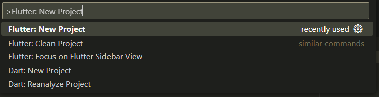
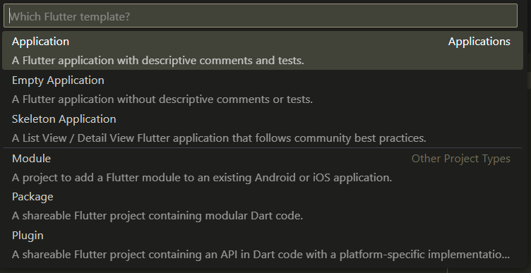
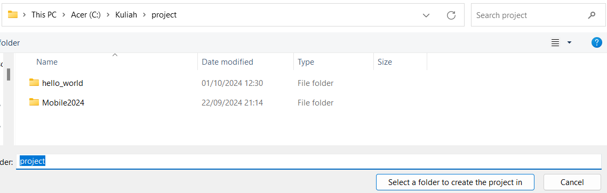
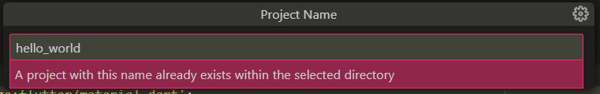
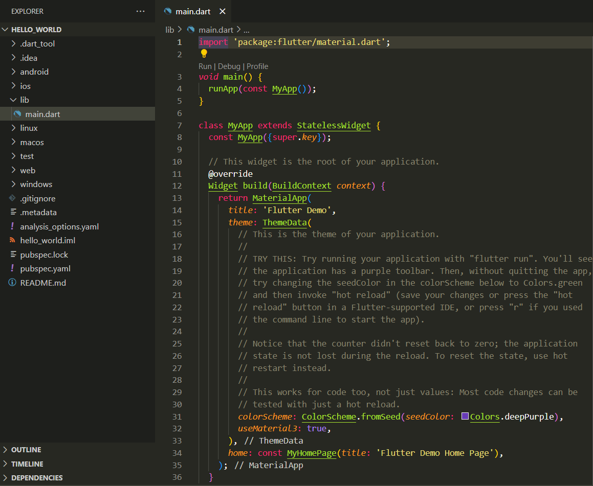

# **#6 Widget Dasar Flutter**

**Nama  : Muhammad Yoanvari Al Farizi**

**NIM   : 2241720096**

**Kelas : TI-3D**

## Praktikum 1: Membuat Project Flutter Baru

### Langkah 1

### Langkah 2

### Langkah 3

### Langkah 4

## Praktikum 2: Membuat Repository GitHub dan Laporan Praktikum

### Langkah 1
### Langkah 2
### Langkah 3
### Langkah 4
### Langkah 5
### Langkah 6
### Langkah 7
### Langkah 8
### Langkah 9
### Langkah 10
### Langkah 11
### Langkah 12